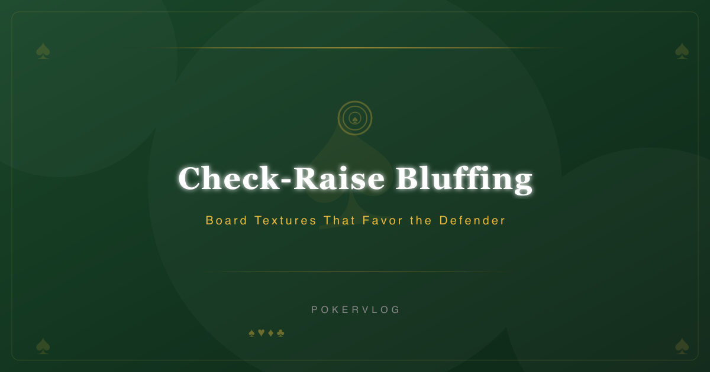
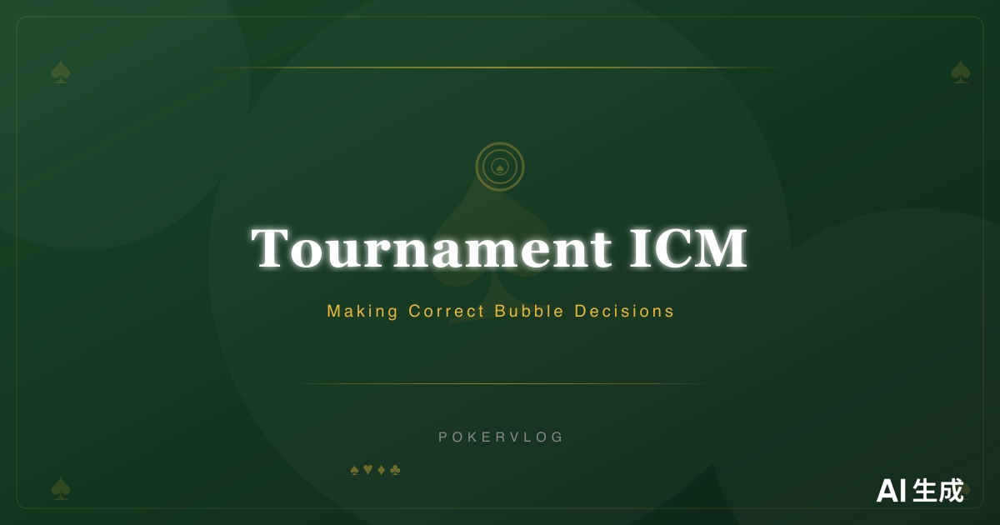
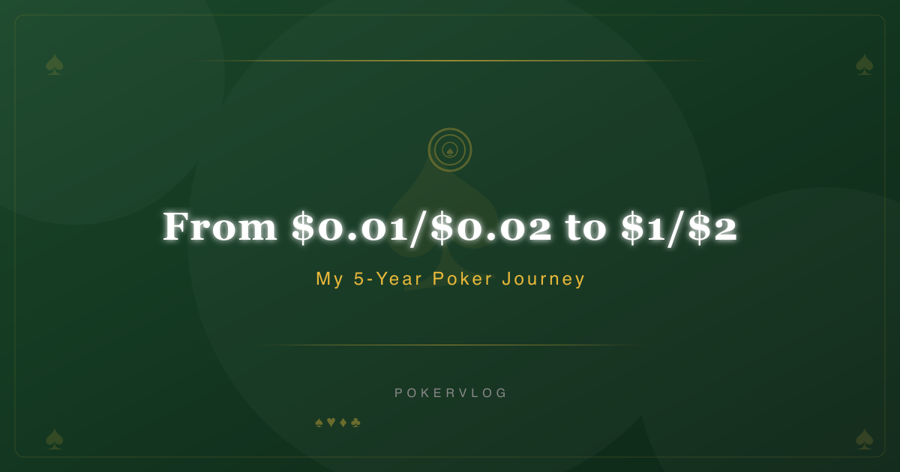
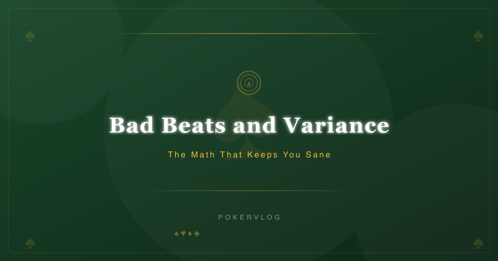

---
AIGC:
    Label: "1"
    ContentProducer: 001191440300708461136T1XGW3
    ProduceID: ab20d8aff180ed14d0ce262937a7b993_938d2e519fbc11f1a413525400287e28
    ReservedCode1: mn/TfleyXsVjrcdvMCOqo1GSO/NAaG+T4AkDHh+dTcW/LkrPFMZP6s5ANVODrA+7j4oJp9e9DVSJ0r4/lExxJOgUEKryqePq/r2eGPNiZV8ssO4S5CtyFZRvJ5UdpxnbB8AOJtZjR0JV/FJzdU5OjIbhxwHypxVFu30602YCqfwjeMUz9jWHbNVzBgg=
    ContentPropagator: 001191440300708461136T1XGW3
    PropagateID: ab20d8aff180ed14d0ce262937a7b993_938d2e519fbc11f1a413525400287e28
    ReservedCode2: mn/TfleyXsVjrcdvMCOqo1GSO/NAaG+T4AkDHh+dTcW/LkrPFMZP6s5ANVODrA+7j4oJp9e9DVSJ0r4/lExxJOgUEKryqePq/r2eGPNiZV8ssO4S5CtyFZRvJ5UdpxnbB8AOJtZjR0JV/FJzdU5OjIbhxwHypxVFu30602YCqfwjeMUz9jWHbNVzBgg=
---

# Poker Vlog

每日自动发布的德州扑克策略 Vlog，记录从 $0.01/$0.02 到 $1/$2 的五年扑克旅程。

## Latest Vlogs
### 2026-09-22 — Check-Raise Bluffing: Board Textures That Favor the Defender

[Read full article](src/content/vlog/check-raise-bluffing-board-textures-that-favor-the-defender-2026-09-22.md)

### 2026-09-21 — Preflop 3-Bet Ranges: When to Light 3-Bet

[Read full article](src/content/vlog/preflop-3-bet-ranges-when-to-light-3-bet-2026-09-21.md)

### 2026-09-20 — Block Betting on the River: Thin Value and Bluff Inducers

[Read full article](src/content/vlog/block-betting-on-the-river-thin-value-and-bluff-inducers-2026-09-20.md)

### 2026-09-19 — Tournament ICM: Making Correct Bubble Decisions

[Read full article](src/content/vlog/tournament-icm-making-correct-bubble-decisions-2026-09-19.md)

### 2026-09-18 — Bad Beats and Variance: The Math That Keeps You Sane

[Read full article](src/content/vlog/bad-beats-and-variance-the-math-that-keeps-you-sane-2026-09-18.md)

### 2026-09-17 — From $0.01/$0.02 to $1/$2: My 5-Year Poker Journey

[Read full article](src/content/vlog/from-001002-to-12-my-5-year-poker-journey-2026-09-17.md)

### 2026-09-16 — Bad Beats and Variance: The Math That Keeps You Sane

[Read full article](src/content/vlog/bad-beats-and-variance-the-math-that-keeps-you-sane-2026-09-16.md)

## About

- 站点: [poker-vlog.pages.dev](https://poker-vlog.pages.dev)
- 技术栈: Astro + Cloudflare Pages
- 发布方式: 每日自动生成 vlog 内容与封面图，构建后自动发布
*（内容由AI生成，仅供参考）*
