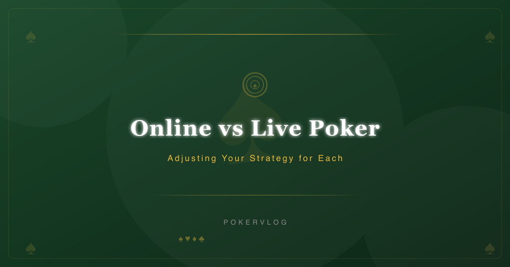
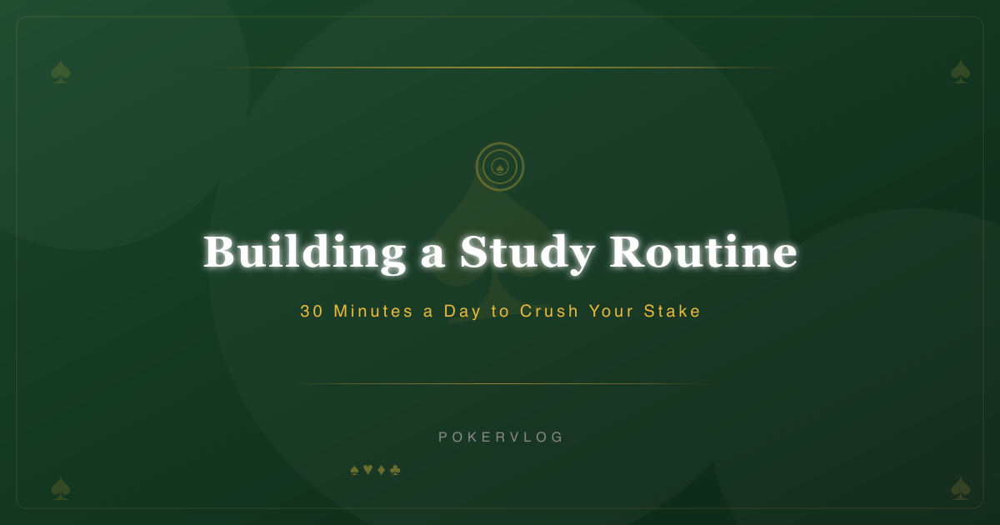

# Poker Vlog

每日自动发布的德州扑克策略 Vlog，记录从 $0.01/$0.02 到 $1/$2 的五年扑克旅程。

## Latest Vlogs

### 2026-08-24 — Online vs Live Poker: Adjusting Your Strategy for Each

[Read full article](src/content/vlog/online-vs-live-poker-adjusting-your-strategy-for-each-2026-08-24.md)

### 2026-08-23 — Building a Study Routine: 30 Minutes a Day to Crush Your Stake

[Read full article](src/content/vlog/building-a-study-routine-30-minutes-a-day-to-crush-your-stak-2026-08-23.md)

### 2026-08-22 — Tilt Control: How I Saved 3 Buy-ins by Walking Away

[Read full article](src/content/vlog/tilt-control-how-i-saved-3-buy-ins-by-walking-away-2026-08-22.md)

### 2026-08-21 — Bankroll Management: How Many Buy-ins Do You Really Need?

[Read full article](src/content/vlog/bankroll-management-how-many-buy-ins-do-you-really-need-2026-08-21.md)

## About

- 站点: [poker-vlog.pages.dev](https://poker-vlog.pages.dev)
- 技术栈: Astro + Cloudflare Pages
- 发布方式: 每日自动生成 vlog 内容与封面图，构建后自动发布
